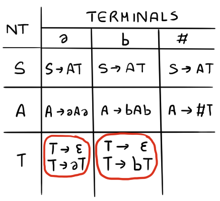
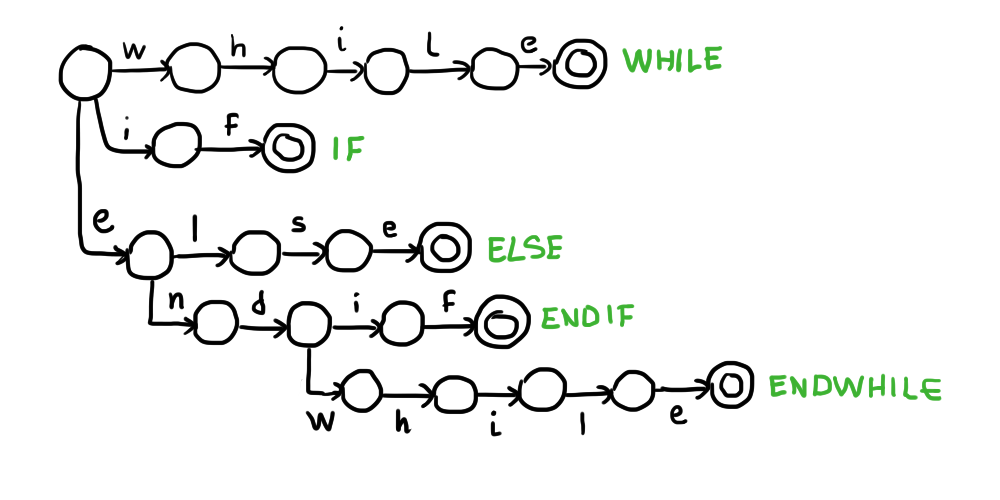
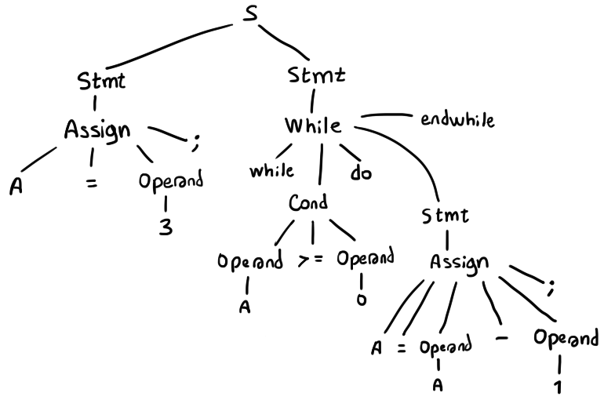
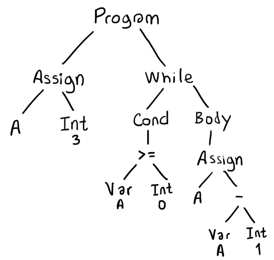
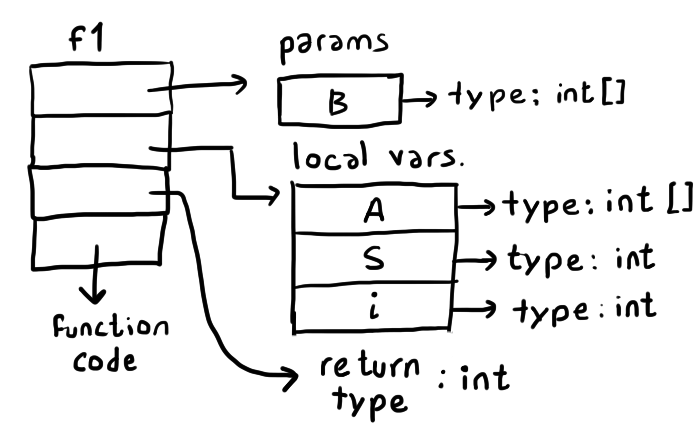
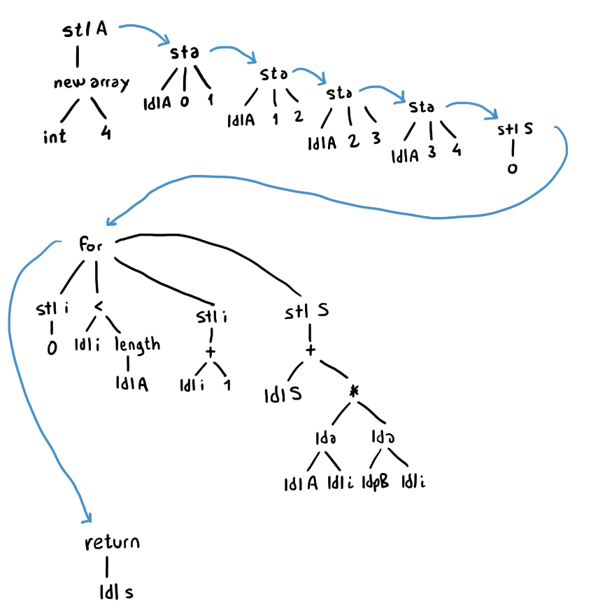

## Midterm 1

**1. a)**
```
First(S) = { 'a', 'b', '#' }
Follow(S) = { $ }

First(A) = { 'a', 'b', '#' }
Follow(A) = { 'a', 'b', $ }

First(T) = { 'a', 'b', ε }
Follow(T) = { 'a', 'b', $ }
```
**b)** 



**c)** The grammar is not LL(1), since two of the cells of the T variable in the parser table have more than one production rule. In order to remove these conflicts, the grammar would have to be modified. Since the variable T has the production rule `T -> ε`, we could modify the grammar like so:
```
S -> AT
A -> aAa | bAb | #
T -> aT | bT | ε
```
This modified grammar would still accept the same strings as the initial grammar, however `Follow(T)` would simply be `{ $ }`, therefore there would be no conflicts in the `LL(1)` parser table.

**2. a)**
```
OP = \+ | - | \* | /
CMP = != | == | > | < | >= | <=
```
**b)**



**c)**



**d)**



**e)**
```c
bool Stmt() {
    if (token == WHILE) {
        return While();
    }
    else if (token == IF) {
        return If();
    }
    else if (token == IDENTIFIER) {
        return Assign();
    }
    return false;
}

bool While() {
    if (token == WHILE) {
        token = next();
        if (!Cond()) {
            return false;
        }
        if (token == DO) {
            token = next();
            while (token != ENDWHILE) {
                if (!Stmt()) {
                    return false;
                }
            }
            token = next();
            return true;
        }
    }
    return false;
}
```

**f)**
```
Stmt -> input(); | print( IDENTIFIER );
```

**3. a)** 



**b)**



**c)** We can only apply this kind of verification during the semantic analysis step if we know the values that are used as indices of the array at compile time. Therefore, it is better to perform this type of checking after constant propagation / constant folding, in order to cover more cases. 

We also need to know the size of the array at compile time in order to verify that indices greater than N - 1 are not being used. Considering that array variables can be reassigned, therefore potentially changing size, we need to keep this information updated throughout the program's flow of execution, similar to what is done during constant propagation. When the flow of execution is not known at compile time (if statements, loops), we might not be able to perform upper bound checking.

**4. a)** True. An ambiguous grammar has more than one possible syntax tree for at least one string, meaning there will be several possible derivations in one of the cells of the LL(1) parser table.
**b)** False. It is possible to implement the lexical, syntactic and semantic analysis in a single stage, however, it is easier to do them sequentially: we can generate a sequence of tokens during the lexical analysis which can be the input of the syntactic analysis stage, which can then generate an AST which will be the input of the semantic analysis step. This pipeline design leads to simpler and cleaner code.
