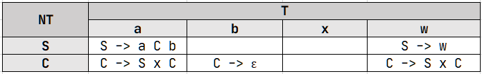
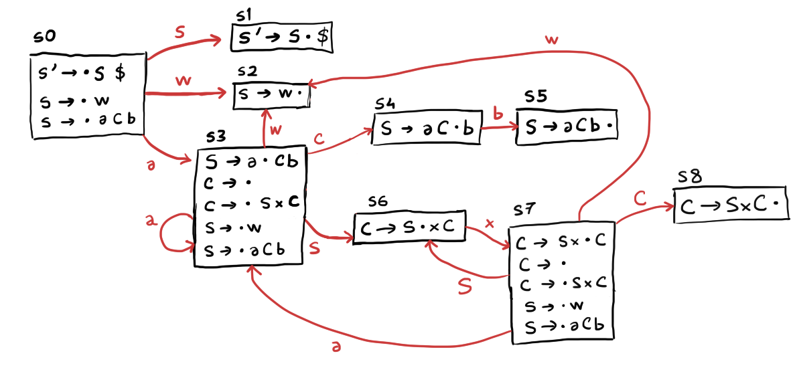

## Exam

**1. a)**
```
First(S) = { 'w', 'a' }
Follow(S) = { $, 'x' }

First(C) = { ε, 'w', 'a' }
Follow(C) = { 'b' }
```
**b)** The grammar is LL(1) since there is at most one production rule for each cell in the parsing table.



**c)** The grammar is not ambiguous since for each terminal symbol, there is only one production rule that can produce that symbol.

**d)**
```
Items
-----
S' -> · S $
S' -> S · $
S -> · w
S -> w ·
S -> · a C b
S -> a · C b
S -> a C · b
S -> a C b ·
C -> ·
C -> · S x C
C -> S · x C
C -> S x · C
C -> S x C ·
```



**e)** The grammar is LR(0), since the LR(0) parser table, presented below, has no shift / reduce or reduce / reduce conflicts.


**f)** A CFG is `LL(k)` if it can be analysed by a top-down predictive parser with lookahead = k, that is, there exists an `LL(k)` parser table without production rule conflicts.

For example, the grammar:
```
S -> ab | ac
```
is `LL(2)`. The `LL(1)` parser table for it is:
<table>
    <thead>
        <tr>
            <th></th>
            <th colspan="3">Terminals</th>
        </tr>
    </thead>
    <tbody>
        <tr>
            <th>Non-Terminals</th>
            <th>a</th>
            <th>b</th>
            <th>c</th>
        </tr>
        <tr>
            <td>S</td>
            <td><code>S -&gt; ab<br>S -&gt; ac</code></td>
            <td></td>
            <td></td>
        </tr>
    </tbody>
</table>

It is not `LL(1)` since there is a conflict. However, if we analyse the `LL(2)` parse table, we can see that there are no conflicts:

<table>
    <thead>
        <tr>
            <th></th>
            <th colspan="2">Terminals</th>
        </tr>
    </thead>
    <tbody>
        <tr>
            <th>Non-Terminals</th>
            <th>ab</th>
            <th>ac</th>
        </tr>
        <tr>
            <td>S</td>
            <td><code>S -&gt; ab</code></td>
            <td><code>S -&gt; ac</code></td>
        </tr>
    </tbody>
</table>

**2. a)** 
```
Tokens
------
FOR = for
ENDFOR = endfor

Rules
-----
Stmt -> For | DoWhile
For -> For Assign Cond ; Assign (Stmt)* ENDFOR
DoWhile -> DO (Stmt)* WHILE Cond ENDWHILE
```
**b)** Since none of the original productions of `Stmt` begin with a `DO` or `FOR` token like the new productions of `Stmt`, the additional productions will not prevent it from being LL(1) or make it an ambiguous grammar.

**3. a)** 

**4. a)** 


**b)** 


**c)** 

**d)** The following heuristic was used for coalescing (George): `a` can be coalesced with `b` if every neighbor `t` of `a` already interferes with `b` or has a low degree (`< K`).


**5. a)**