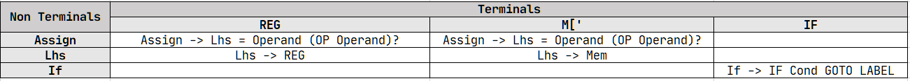
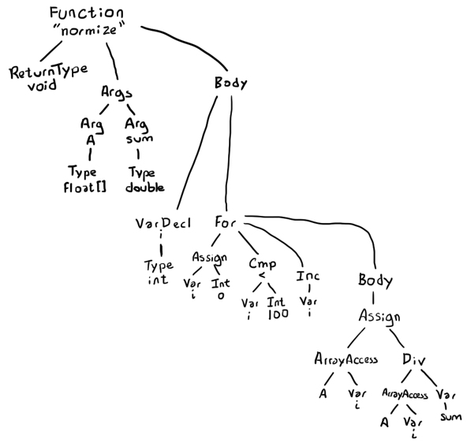
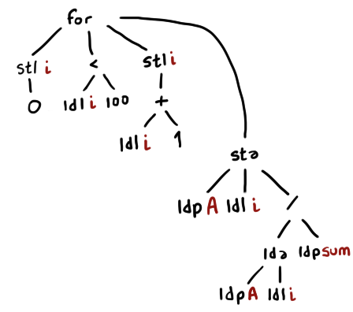
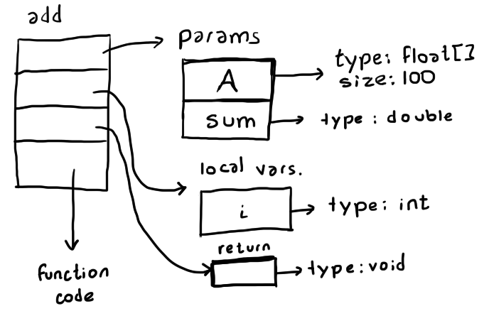
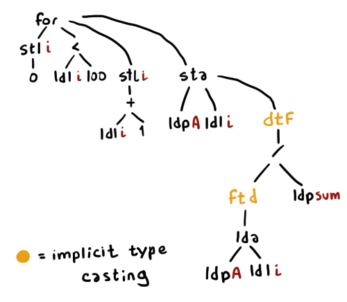

## Midterm 1

❗ **1. a)** `REG('$2') EQ('=') CONST('0') SEMICOLON(';') LABEL('L') CONST('2') COLON(':') IF('if') REG('$2') CMP('>=')`   
**b)** ✔️
```
First(Assign) = { REG, 'M[' }
Follow(Assign) = { IF, GOTO, LABEL, REG, 'M[', $ }

First(Lhs) = { REG, 'M[' }
Follow(Lhs) = { = }

First(If) = { IF }
Follow(If) = { IF, GOTO, LABEL, REG, 'M[', $ }
```
**c)** ✔️



**d)** We cannot conclude that the grammar is not LL(1), since each cell in the parser table contains at most one production rule. To conclude that the grammar isn't LL(1), one of the cells of the table must have more than one production rule, meaning there is ambiguity as to which one should be picked. ✔️  
**e)** Only a lookahead of 1 is required. ✔️
```
If() {
    if (token == IF) {
        token = next();
        Cond();
        if (token == GOTO) {
            token = next();
            if (token == LABEL) {
                token = next();
                accept();
                return;
            }
        }
    }
    fail();
}

Cond() {
    Operand();
    if (token == CMP) {
        Operand();
        return;
    }
    fail();
}

Operand() {
    if (token == REG || token == CONST) {
        token = next();
        return;
    }
    else {
        Mem();
    }
}

Mem() {
    if (token == "M[") {
        token = next();
        Operand();
        if (token == "]") {
            token = next();
            return;
        }
    }
    fail();
}
```

**2. a)** ✔️



**b)** 



**c)** 



**d)** 



**3. a)**
**b)** 