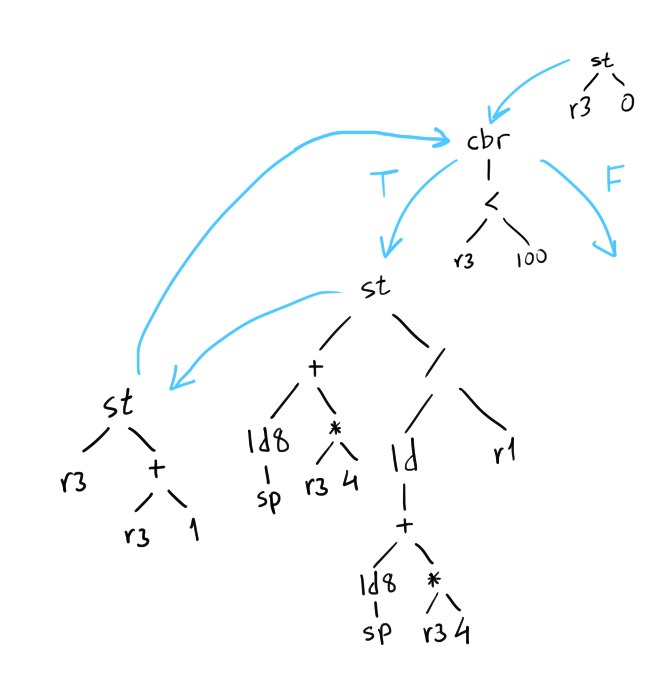
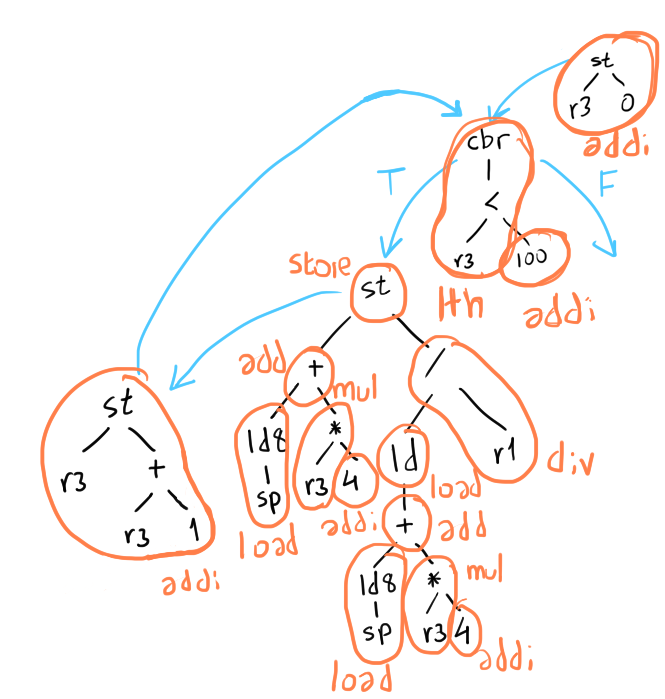
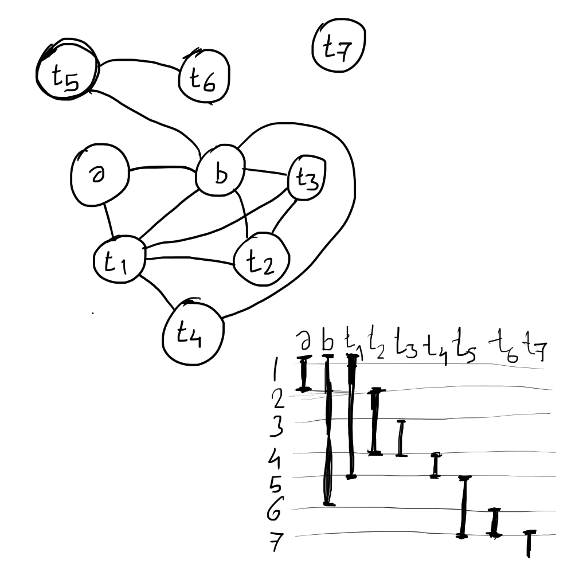
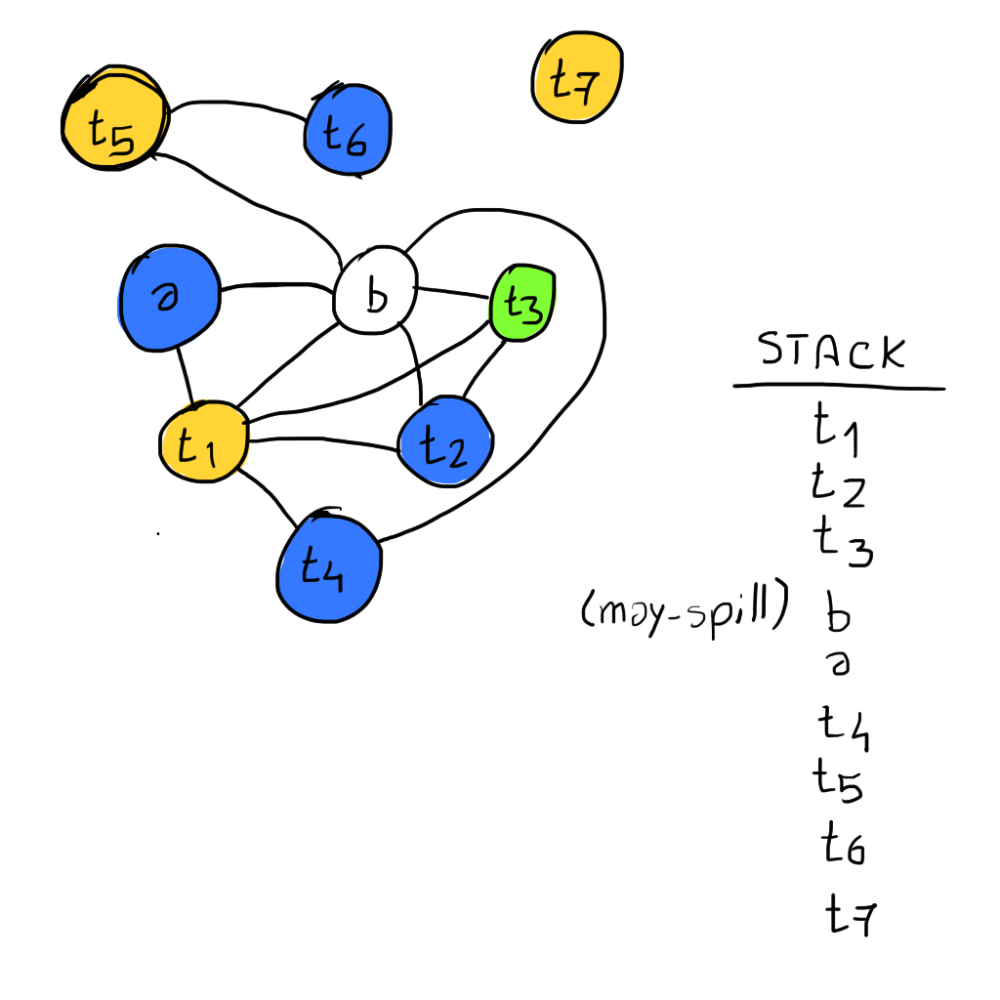
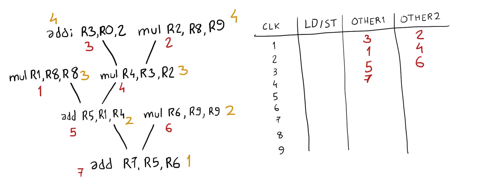

## Midterm 2

**1. a)** ✔️



**b)** ✔️



**2. a)** ✔️



**b)** Node b is spilled, since there are not enough registers. ✔️

```
R1 = { t1, t5, t7 }
R2 = { a, t2, t4, t6 }
R3 = { t3 }
```



**c)** The instructions in the longest latency path are scheduled first (i. e., the ones which have the largest height in the DDG, specified in gold). In this case, tie-breaks were not necessary. ✔️



**3. a)** 
**b)** 